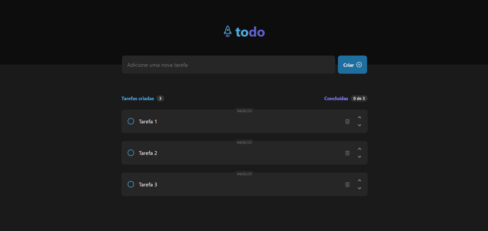
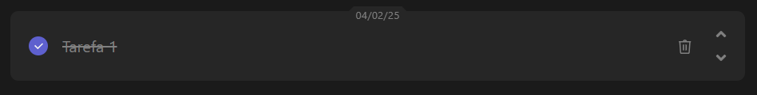

# To-Do List

Um aplicativo simples e eficiente de lista de tarefas, desenvolvido com **React**, **JavaScript** e **CSS Modules**.

 

## 🚀 Funcionalidades

- 📌 Criar novas tarefas
- 🗑️ Excluir tarefas
- 🔄 Reordenar tarefas
- ✅ Marcar tarefas como concluídas

 

## 🛠️ Tecnologias Utilizadas

- [React](https://react.dev/)
- JavaScript
- CSS Modules

 

## 🖼️ Capturas de Tela

### 📌 Tela Inicial

### ✅ Tarefa Concluída

 

O projeto está disponível em **https://valmirpst.github.io/to-do-list/**.

---

Feito por mim, <a href="https://github.com/valmirpst">Valmir Paiva Stachin</a>.

